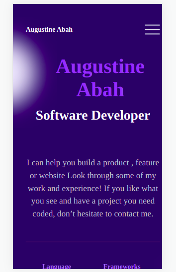

# I designed the milestone portfolio project.

> The project is to create the mobile version and desktop version of my Portfolio.

## Built With

- HTML and CSS

## Live Demo

Portfolio-Online version: [Portfolio Link](https://ababaug.github.io/)

## Getting Started

**This is an example of how you may give instructions on setting up your project locally.**
**I wrote the code on HTML and CSS then added linter configuration files **

## Author

👤 **Augustine Stephen Abah**

- GitHub: [@githubhandle](https://github.com/ababaug)
- Twitter: [@twitterhandle](https://twitter.com/twitterhandle)
- LinkedIn: [LinkedIn](https://www.linkedin.com/in/augustine-abah-862202161)
- Portfolio-Online version: [Portfolio Link](https://ababaug.github.io/)

## 🤝 Contributing

Contributions, issues, and feature requests are welcome!

Feel free to check the [issues page](../../issues/).

## Show your support

Give a ⭐️ if you like this project!

## Acknowledgments
